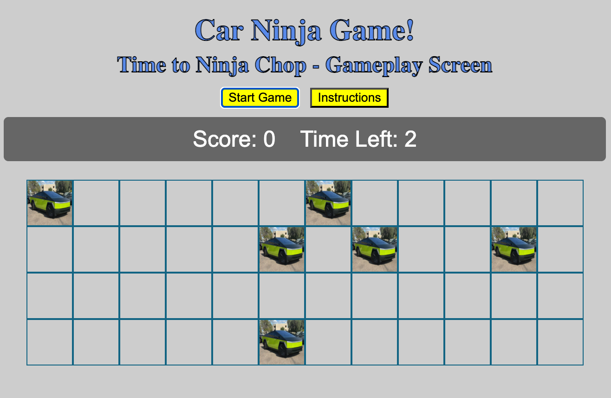
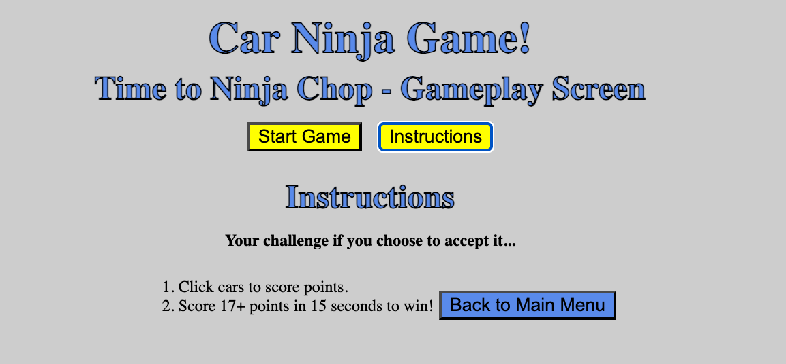

# Car Ninja!

Ready to ninja chop some cars??!? Have all the cars around you been driving too slowly in the fast lane, lately? And you're done with it?! If so, Car Ninja is for you!

## Screenshot of Car Ninja App with Instructions

## Description & Background Info
Car Ninja was originally inspired by the game Fruit Ninja! I had big plans to create something almost identical to Fruit Ninja; except instead of slicing fruit, you'd be clicking on cars and watching them break apart!

Background Info: I chose to create this game because (1) Fruit Ninja is FUN! Who doesn't like to slice random fruit and see it splat everywhere, without the real-life cleanup?! And (2) I wanted to create a game that is similar but with cars because when I drive in the United States, the drivers are horrible and they like to drive slowly in the fast lanes, and also don't abide by driving rules. I thought it would be fun to create a game where you could "slice" a car that's a poor driver (since you can't do it in real life. hehe). I figure this new rendition could be the solution for "road rage". Just play Car Ninja, and you won't want to do crazy things on the real road! lol

Ultimately, in its current iteration, it is purely a game in which you click on cars to score points. You have 15 seconds to click on 17 cars to win! Otherwise, you lose. It is very similar to Whackamole except cybertrucks are randomly generated and you click on them. Due to the fact that I'm a beginner coder, this is the best I can do at this point. I, however, still plan on continuing my quest to create this game exactly as I intended with rogue potholes (to lose lives), sound effects, random comic-strip-looking word bubbles that come from the cars, and funny comments generated by a ninja and by the cars.

## Getting Started

### Deployed Game: wait for it... wait for it...

Instructions: 
- (1) Click on "Start Game" Button to commence the game. 
- (2) Click cars to score points.
- (3) Score 17+ points in 15 seconds to win!

Excalidraw Proposal Rendering: https://excalidraw.com/#json=sC5spph5Pl5N-gakOGVoD,z0pOg97SMsKWoaxYUjVtcA

Link to my planning materials: https://excalidraw.com/#json=sC5spph5Pl5N-gakOGVoD,z0pOg97SMsKWoaxYUjVtcA

# User Stories:
As a player, I want cars to appear in a grid so that I can interact with them visually.
As a player, I want to click on slow cars so that I can earn points and feel rewarded.
As a player, I want slow cars to break apart when clicked so that it feels like I sliced them.
As a player, I want a ninja sound to play when I slice a car so that the game feels more fun and dramatic.
As a player, I want my score to go up when I slice a slow car so that I can track my success.
As a player, I want the game to subtract points if I click the wrong car so that I’m challenged to pay attention.
As a player, I want to lose points if I don’t click a slow car in time so that I feel urgency to act.
As a player, I want some cars to shout funny or rude insults so that the game has personality and makes me laugh.
As a player, I want those insults to appear in speech bubbles so that it feels like a cartoon scene.
As a player, I want to see my score update immediately so that I always know how I’m doing.
As a player, I want to know when the game is over so that I can stop playing and see my final score.
As a player, I want to see a “Game Over” screen with my score so that I can feel a sense of completion.
As a player, I want some cars to spin or wiggle so that it’s harder to click them.
As a player, I want to see visual feedback when I click something wrong so I know I made a mistake.
As a player, I want the game to get harder over time so that I stay engaged.
As a player, I want the game to give me positive messages when I score well so I feel encouraged.
As a player, I want the game to include accessibility features so I can play no matter my abilities.

Pseudocode:

README Requirements:
4. Attributions: This section should include links to any external resources (such as libraries or assets) you used to develop your application that require attribution. You can exclude this section if it does not apply to your application.
General External Resources:
Libraries: 
Assets:
References:
Image Resources: Auto Trader
Image Link: https://images.autotrader.com/scaler/408/306/hn/c/03775bd69037404893e710eea5872111.jpg

5. Technologies Used: List of the technologies used, for example: HTML, CSS, JavaScript, Google Fonts (is that a technology or just a linked site?), etc.
HTML
CSS
JavaScript

6. Next Steps: Planned future enhancements (stretch goals).
Expanding on the game and creating a full slice rather than just a click
More animations.
More sound effects.
More backdrops including different locations.
A fuller variety of cars.
The ability to be different characters as you play.

7. //If time, add sections including: Features, Screenshot/Images/Visuals Descriptions,MVP Requirements, Early Concept/Ideas, Process aka Build/CodeProcess, Known Issues & Bug Solves, Edge Cases Covered, and also disclaimer since I'm re-creating a game that is already big "Fruit Ninja". Somewhere state that this is educational, for learning class purposes, and is from a ninja-movie-watching-fan!

8. Ahas & Awarenesses from this project while researching code, coding, and fixing bugs

CONSISTENT TEXT - In my data.js section, inside Objects, using consistent text for the "key" in key: value pairs was especially eye opening for me, regarding ease of use later on in coding... Especially in JS iterating over arrays and objects (e.g. forEach, for...loop). Creating consistent text makes code more reusable and easier to maintain.

Example: 

MY INITIAL VERSION:
const carComments = [
    { comment1: "Oh noooo! I was driving to slow!" },//AI is saying I need consistent keys here and to name them all "text"/ask about this
    { comment2: "" },
    { comment3: "" },
    { comment4: "" },
    { comment5: "" } //Took off trailing comment here. Even though comma works with modern JS, doesn't work for older environments.
];

CORRECTED VERSION FOR MORE USEABILITY:
const carComments = [
    { text: "Oh noooo! I was driving to slow!" },//AI is saying I need consistent keys here and to name them all "text"/ask about this
    { text: "" },
    { text: "" },
    { text: "" },
    { text: "" } //Took off trailing comment here. Even though comma works with modern JS, doesn't work for older environments.
];
